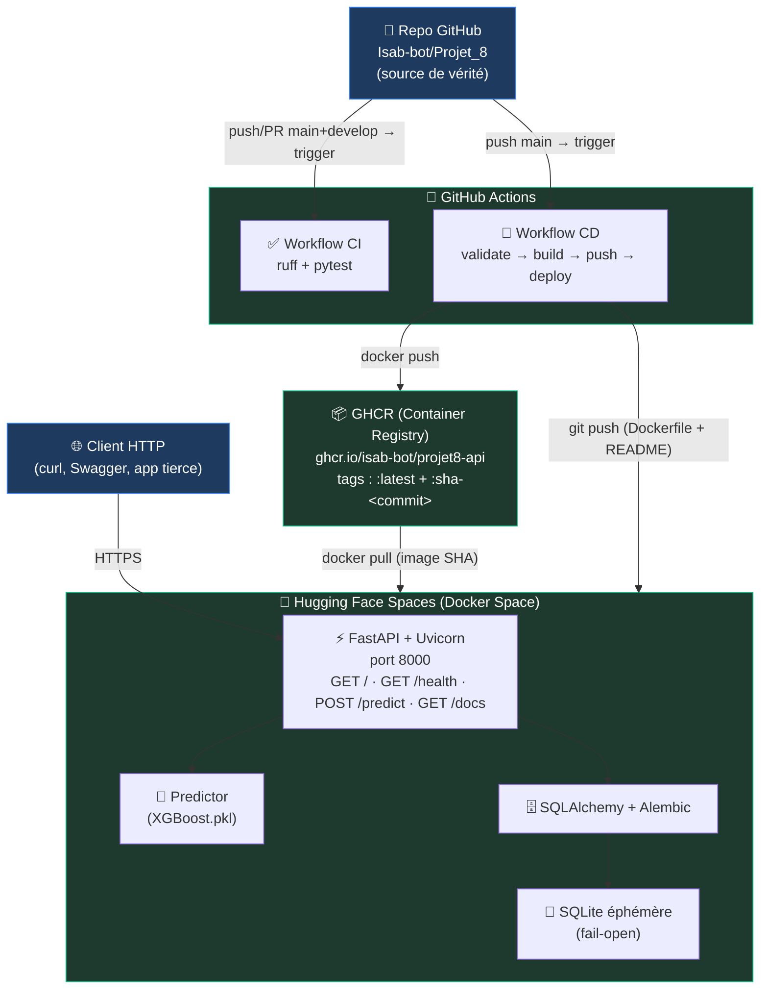
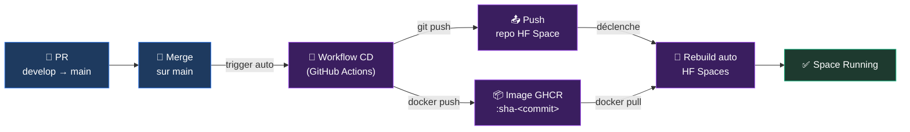
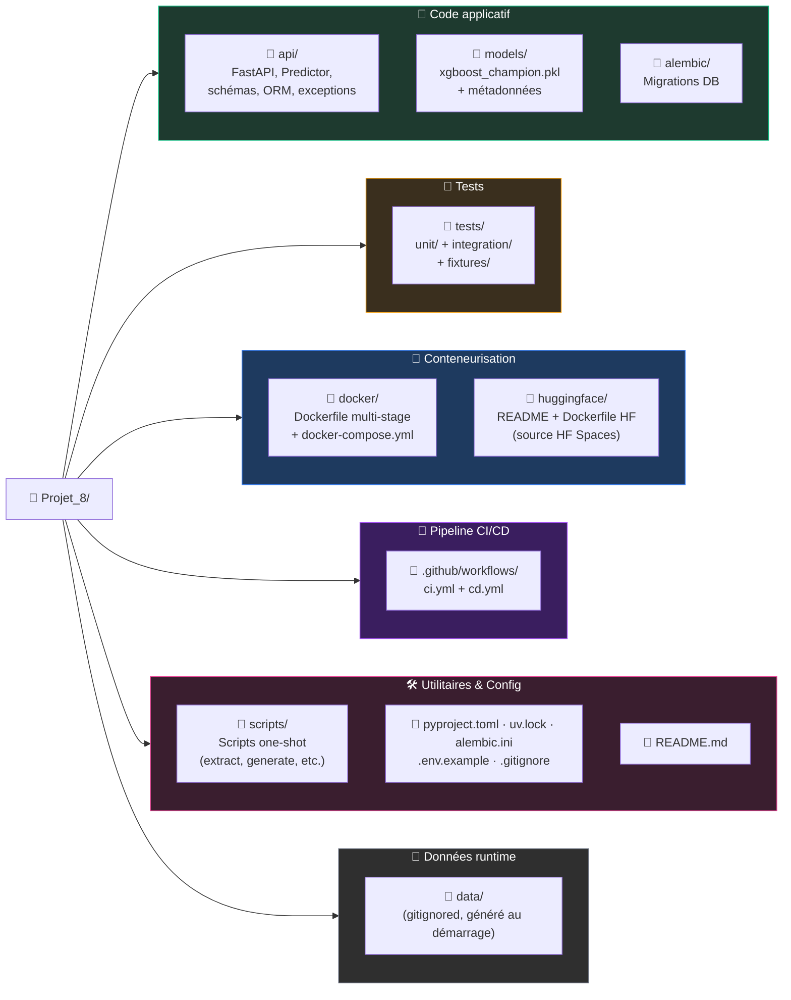

# Projet 8 — Confirmez vos compétences en MLOps

[](https://github.com/Isab-bot/Projet_8/actions/workflows/ci.yml)
[](https://huggingface.co/spaces/Fox6768/projet8-credit-scoring-api)

> Mise en production complète d'un modèle de scoring crédit XGBoost : API REST, conteneurisation, pipeline CI/CD, déploiement automatisé et monitoring de drift. Projet réalisé dans le cadre de la formation **AI Engineer** d'OpenClassrooms (alternance).

---

## 🎯 Objectif et contexte

Ce projet consiste à mettre en production le modèle de scoring crédit développé lors du **Projet 6** (*Initiez-vous au MLOps*) pour l'entreprise fictive *Prêt à Dépenser*. Le modèle XGBoost — entraîné sur le dataset Home Credit (~300 000 dossiers, 326 features) avec un seuil F3 optimisé — est exposé via une API REST publique, déployée automatiquement sur Hugging Face Spaces à chaque release.

Le projet couvre l'ensemble du cycle MLOps post-entraînement :
- exposition du modèle via une **API REST** documentée
- **persistance des prédictions** en base pour le monitoring de drift à venir
- **conteneurisation Docker** multi-stage avec utilisateur non-root
- **pipeline CI/CD** GitHub Actions avec validation, build, registry et déploiement
- **déploiement automatique** sur Hugging Face Spaces via GHCR
- **monitoring de drift** avec Streamlit et Evidently (étape 8 — à venir)

---

## 🌐 Démo live

L'API est accessible publiquement :

- **Page du Space** : https://huggingface.co/spaces/Fox6768/projet8-credit-scoring-api
- **API directe** : https://fox6768-projet8-credit-scoring-api.hf.space
- **Documentation Swagger interactive** : https://fox6768-projet8-credit-scoring-api.hf.space/docs

### Tester la prédiction en une commande

Depuis n'importe quel terminal (avec `curl` installé) :

```bash
curl -X POST "https://fox6768-projet8-credit-scoring-api.hf.space/predict" \
  -H "Content-Type: application/json" \
  --data-binary "@tests/fixtures/sample_request.json"
```

Réponse attendue (exemple) :

```json
{
  "request_id": "76e778b9-8a82-4169-9970-5fa1aa962670",
  "probability": 0.8837481141090393,
  "decision": 1,
  "threshold": 0.33381930539322036
}
```

> **Note** : la base SQLite du Space HF est éphémère (réinitialisée à chaque redémarrage). C'est un choix assumé pour ce projet portfolio (voir [Décisions d'architecture](#-décisions-darchitecture)). En contexte de production réelle, il suffirait de pointer `DATABASE_URL` vers un Postgres managé sans toucher au code.

---

## 🧠 Le modèle

| Caractéristique | Valeur |
|---|---|
| Algorithme | XGBoost (gradient boosting) |
| Pipeline | scikit-learn `ColumnTransformer` + XGBoost |
| Nombre de features | 326 (après feature engineering Projet 6) |
| Seuil de décision | `0.33381930539322036` (optimisé sur F3) |
| Métrique principale | F3 = 0.5583 (rappel privilégié, coût asymétrique des erreurs métier) |
| Dataset d'entraînement | Home Credit Default Risk (304 527 dossiers) |
| Run MLflow source | `a3ff1e12347c4bfc9b484ac36916eb14` (Projet 6) |
| Format de sérialisation | `joblib` (`models/xgboost_champion.pkl`, 3.4 MB) |

Le modèle est **figé** depuis le Projet 6 : aucun ré-entraînement, aucun versioning dynamique. Il est embarqué directement dans l'image Docker pour garantir l'autonomie du déploiement.

---

## 🏗️ Architecture


---

## 🛠️ Stack technique

| Domaine | Outil |
|---|---|
| Langage | Python 3.13 |
| Framework API | FastAPI 0.136 + Uvicorn |
| Modèle ML | XGBoost (artefact Projet 6) + scikit-learn pipeline |
| Validation / sérialisation | Pydantic v2 |
| ORM | SQLAlchemy 2.0 (style `Mapped[]`) |
| Migrations DB | Alembic |
| DB dev | PostgreSQL 16 (Docker) |
| DB prod (HF Spaces) | SQLite éphémère (fallback automatique) |
| Conteneurisation | Docker multi-stage (UV builder + Python slim runtime) |
| Registry d'images | GHCR (GitHub Container Registry) |
| CI/CD | GitHub Actions |
| Déploiement | Hugging Face Spaces (Docker Space) |
| Tests | pytest 9 + pytest-cov 7 + httpx |
| Linting | ruff |
| Gestionnaire de paquets | UV (Astral, PEP 735 dependency-groups) |
| Monitoring (étape 8 à venir) | Streamlit + Evidently |

---

## 🚀 Démarrage rapide en local

### Prérequis

- **Docker Desktop** (Windows) ou **Docker Engine** + **Docker Compose v2** (Linux/Mac)
- Git
- (Optionnel) `curl` pour tester les endpoints depuis le terminal

### Cloner et lancer la stack complète

```powershell
# Cloner le repo
git clone https://github.com/Isab-bot/Projet_8.git
cd Projet_8

# (Optionnel) Copier le template d'environnement
Copy-Item .env.example .env

# Lancer l'API + Postgres via Docker Compose
docker compose -f docker/docker-compose.yml up -d

# Vérifier que tout est healthy
docker compose -f docker/docker-compose.yml ps
```

Au démarrage, l'API applique automatiquement les migrations Alembic (création de la table `predictions`) puis charge le modèle XGBoost. Une fois `healthy` :

- **API** : http://localhost:8000
- **Swagger** : http://localhost:8000/docs
- **Postgres** : `localhost:5433` (utilisateur `credit_user`, mot de passe `credit_pass`, base `credit_scoring`)

### Tester une prédiction en local

```powershell
curl.exe -X POST "http://localhost:8000/predict" `
  -H "Content-Type: application/json" `
  --data-binary "@tests/fixtures/sample_request.json"
```

Tu peux ensuite vérifier que la prédiction a bien été persistée :

```powershell
docker exec -it $(docker compose -f docker/docker-compose.yml ps -q postgres) `
  psql -U credit_user -d credit_scoring -c "SELECT request_id, prediction_proba, prediction FROM predictions ORDER BY id DESC LIMIT 5;"
```

### Arrêter la stack

```powershell
docker compose -f docker/docker-compose.yml down

# Pour supprimer aussi le volume Postgres (perte des données)
docker compose -f docker/docker-compose.yml down -v
```

---

## 🧪 Qualité et tests

Le projet est instrumenté avec **42 tests pytest** (unitaires + intégration) couvrant la logique métier, la persistance et le contrat HTTP. La couverture globale est de **99 %**, exécution en ~3 secondes en local et ~26 secondes en CI.

### Lancer les tests en local

```powershell
# Installer les dépendances de dev (groupe activé par défaut)
uv sync

# Linter
uv run ruff check .

# Tests + couverture
uv run pytest --cov

# Rapport HTML détaillé
uv run pytest --cov --cov-report=html
# → ouvrir htmlcov/index.html
```

### Stratégie de tests

- **Unitaires** (25 tests) : logique pure isolée par des mocks (Predictor, naming, service DB)
- **Intégration** (17 tests) : `TestClient` FastAPI avec vrai modèle XGBoost chargé, SQLite de test pour vérifier la persistance bout-en-bout

### Points verrouillés par tests

| Politique | Test | Pourquoi |
|---|---|---|
| Fail-open DB | `TestPredictFailOpen.test_db_error_returns_200_anyway` | Si quelqu'un retire le `try/except SQLAlchemyError`, le test échoue. L'observabilité ne doit jamais casser le service observé. |
| Validation Pydantic | `TestPredict422` | Tout payload mal formé doit retourner 422 avec un message lisible. |
| Modèle non chargé | `TestPredict503` | Si `app.state.predictor=None`, l'API renvoie 503 (pas 500). |
| Cohérence des prédictions | `TestPredictHappyPath` | La probabilité retournée est identique à celle du reference dataset (vérifie qu'aucune dérive n'a été introduite dans le pipeline). |

---

## 🔁 CI/CD

Deux workflows GitHub Actions distincts, avec des responsabilités séparées :

### Workflow CI (`.github/workflows/ci.yml`)

- **Déclencheurs** : push et pull request vers `main` et `develop`
- **Job unique** sur `ubuntu-latest` :
  1. Checkout du code
  2. Setup UV (Python 3.13, cache activé)
  3. `uv sync --frozen` (installe les dépendances de prod + le groupe `dev`)
  4. `uv run ruff check .`
  5. `uv run pytest --cov`
- **Concurrency** : un seul run actif par branche, annulation des précédents
- **Durée typique** : ~25 s

### Workflow CD (`.github/workflows/cd.yml`)

- **Déclencheurs** :
  - `workflow_dispatch` (manuel) — pour les re-déploiements, les corrections d'urgence et le debug
  - `push: branches: [main]` — pour le déploiement automatique en production
- **Trois jobs séquentiels** (`needs:` chaîné) :
  1. **`validate`** — re-exécute ruff + pytest (filet de sécurité avant tout déploiement)
  2. **`build-and-push-ghcr`** — build de l'image multi-stage depuis `docker/Dockerfile`, push vers GHCR avec deux tags : `:latest` (pointeur mouvant) et `:sha-<commit-court>` (traçabilité)
  3. **`deploy-to-hf`** — clone le repo Git Hugging Face Space, copie `huggingface/README.md` et réécrit le `huggingface/Dockerfile` avec le tag SHA (via `sed`), puis push vers HF
- **Concurrency** : un seul déploiement à la fois, pas d'annulation (pour éviter de couper un déploiement en cours)
- **Durée typique** : ~3 minutes (validate ~30 s + build & push ~2 min + deploy ~15 s)

### Pourquoi le tag SHA dans le Dockerfile HF ?

HF Spaces ne déclenche un rebuild que lorsque son repo Git reçoit un commit. Avec un tag `:latest` figé dans le Dockerfile HF, le contenu ne change jamais entre deux déploiements GHCR, donc HF ne rebuild pas et reste sur son ancienne image en cache. En réécrivant le tag en `:sha-<commit-court>` (différent à chaque commit), on garantit :
- un **rebuild HF automatique** à chaque déploiement
- une **traçabilité totale** : le Dockerfile HF affiche en clair quel commit GitHub produit l'image qui tourne
- un **rollback facile** : éditer le Dockerfile HF pour pointer sur n'importe quel `sha-*` antérieur

---

## 📦 Déploiement

### Flux nominal 

Toute fusion sur `main` déclenche le pipeline CD complet. Le déploiement HF Spaces se fait sans intervention manuelle.


### Déclenchement manuel

Pour redéployer la même image (par exemple après un rollback HF), ou pour déboguer :

1. Aller sur https://github.com/Isab-bot/Projet_8/actions/workflows/cd.yml
2. Cliquer sur **Run workflow**
3. Sélectionner la branche (par défaut `develop`, ou n'importe quelle autre)
4. Confirmer

### Rollback

Trois niveaux possibles, du plus rapide au plus structurel :

1. **Rollback côté HF uniquement** : éditer `Dockerfile` dans le repo HF Space pour pointer sur un tag `sha-*` antérieur. HF rebuild automatiquement avec l'ancienne image. Effet : immédiat (~1 min). Pas de modification côté GitHub.
2. **Revert Git + redéploiement** : `git revert <commit>` sur `main` → la PR déclenche le CD → nouvelle image avec l'état antérieur du code.
3. **Hotfix branch** : créer une branche `hotfix/...` depuis le dernier commit stable, corriger, PR vers `main`.

---

## 🧭 Décisions d'architecture

Les choix structurants du projet sont documentés ici pour faciliter la lecture du code et préparer la soutenance.

### Postgres en dev, SQLite en fallback

L'API supporte les deux backends via la variable d'environnement `DATABASE_URL`. En dev local, Docker Compose lance un Postgres 16 dédié. En CI et sur HF Spaces, la variable n'est pas définie : le code bascule automatiquement sur SQLite (`data/predictions.db`). Cette dualité permet de prouver que la stack scale (Postgres = production-ready) tout en restant déployable gratuitement (SQLite = pas d'infrastructure managée). En production réelle, il suffirait d'injecter une `DATABASE_URL` pointant vers un Postgres managé (Neon, Supabase, RDS, Cloud SQL...) sans aucune modification du code applicatif.

### SQLite éphémère sur HF Spaces (assumé)

La SQLite est réinitialisée à chaque redémarrage du Space HF. C'est un choix volontaire pour un projet portfolio gratuit : pas de coût d'hébergement, fallback automatique déjà testé. Pour le monitoring de drift (étape 8), la stratégie sera ajustée — soit en activant le Persistent Storage HF (payant), soit en utilisant un Postgres managé externe (gratuit jusqu'à un certain seuil).

### Politique fail-open sur la persistance

Si l'INSERT en base échoue dans `POST /predict`, l'erreur est loggée (niveau ERROR, avec stack trace et `request_id`) mais la prédiction est tout de même retournée au client. L'instrumentation ne doit jamais casser le service observé. Cette politique est **verrouillée par un test dédié** (`TestPredictFailOpen.test_db_error_returns_200_anyway`) qui échoue si quelqu'un retire le `try/except`.

### Modèle `.pkl` embarqué dans l'image Docker

Le pipeline scikit-learn + XGBoost (3.4 MB) est copié directement dans l'image, plutôt que monté en volume ou téléchargé au démarrage. HF Spaces ne fournit pas de stockage externe accessible sans configuration spécifique, et le modèle est figé depuis le Projet 6 — il n'y a aucune raison de le re-charger dynamiquement. Cette approche garantit l'autonomie complète du container et la reproductibilité du déploiement.

### Dockerfile multi-stage (UV builder + Python slim runtime)

L'image finale est buildée en deux étapes : un stage `builder` basé sur l'image officielle UV (qui installe les dépendances dans un venv), puis un stage `runtime` basé sur `python:3.13-slim-bookworm` qui copie uniquement le venv et le code applicatif. L'image runtime ne contient ni UV ni outils de build, ce qui réduit la surface d'attaque et la taille (618 MB content size, 1.89 GB disk usage).

### User non-root UID 1000

Le container tourne en tant qu'utilisateur `appuser` (UID 1000) pour respecter la convention HF Spaces et appliquer le principe du moindre privilège. Le dossier `/app/data/` (pour la SQLite éphémère) est créé en root pendant le build puis chown à `appuser`, parce que SQLite refuse de créer une base dans un dossier inexistant.

### UV `dependency-groups` (PEP 735)

Les dépendances sont organisées en trois ensembles distincts :
- `[project] dependencies` : 12 paquets de runtime API (FastAPI, SQLAlchemy, xgboost, etc.)
- `[dependency-groups] dev` : pytest, pytest-cov, httpx, ruff — activé par défaut par `uv sync`
- `[dependency-groups] monitoring` : streamlit, evidently, plotly — non activé par défaut, à demander explicitement via `--group monitoring`

Cette organisation permet de produire une image Docker minimale (`uv sync --frozen --no-dev --no-group monitoring`) et de préparer une seconde image dédiée au monitoring à l'étape 8.

### Tag SHA dans le Dockerfile HF (vs `:latest`)

Le `huggingface/Dockerfile` dans le repo GitHub utilise `:latest` (lisible, testable en local), mais le workflow CD réécrit ce tag en `:sha-<commit-court>` via `sed` avant de pousser vers HF. Ce détail technique garantit que HF reçoit un vrai commit Git à chaque déploiement (donc un rebuild automatique) et apporte une traçabilité totale entre les images en production et les commits GitHub.

### Git Flow + Conventional Commits + PR systématiques

Le projet suit une convention Git Flow stricte :
- `main` = branche de release (déclenche le CD)
- `develop` = branche d'intégration (déclenche la CI uniquement)
- `feature/*`, `fix/*`, `chore/*` = branches de travail, mergées vers `develop` via PR

Tous les commits suivent les [Conventional Commits](https://www.conventionalcommits.org/) (`feat:`, `fix:`, `chore:`, `docs:`, `test:`, `refactor:`). Aucune modification ne touche `develop` ou `main` sans passer par une Pull Request avec CI verte.

---

## 📁 Structure du repo


---

## 📊 Livrables OpenClassrooms

- [x] API FastAPI fonctionnelle (endpoints `/`, `/health`, `/predict`, `/docs`)
- [x] Tests unitaires et d'intégration (42 tests, couverture 99 %)
- [x] Dockerfile multi-stage
- [x] Stockage des prédictions (PostgreSQL en dev, SQLite en prod HF)
- [x] Pipeline CI GitHub Actions (ruff + pytest sur push/PR `main`/`develop`)
- [x] Pipeline CD GitHub Actions (build & push GHCR, déploiement HF auto sur `main`)
- [x] Déploiement Hugging Face Spaces (image publique, API accessible)
- [x] Documentation README (ce fichier)
- [ ] Dashboard de monitoring (drift, latence, scores) — **étape 8 à venir**
- [ ] Optimisation performance (taille image, démarrage) — **étape 9 à venir**
- [ ] Documentation utilisateur étendue (MkDocs) — **étape 10 à venir**

---

## 👤 Auteur

**Isabelle **
AI Engineer en alternance — formation OpenClassrooms

Projet réalisé dans le cadre du parcours *AI Engineer*, étape 8 : *Confirmez vos compétences en MLOps*. Le modèle source provient du Projet 6 (*Initiez-vous au MLOps*) du même parcours.

Repo GitHub : https://github.com/Isab-bot/Projet_8

